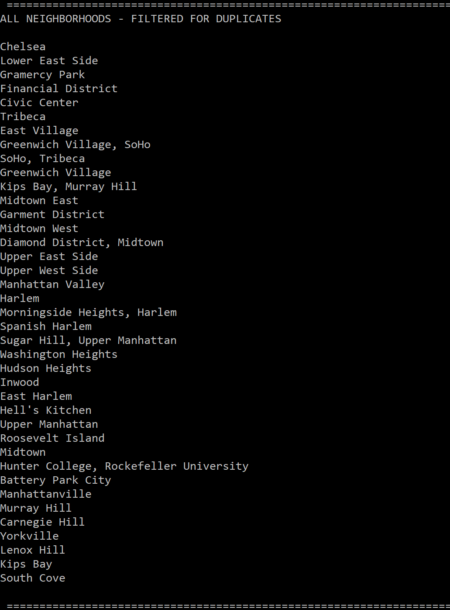

# Lab08-LINQ-in-Manhattan
CF 401 Lab-08: LINQ in Manhattan (using LINQ with JSON data; C#)

## Description
This application reads in a JSON data file, converts it to a queryable object, and queries the object for data. It completes the same search/filter 3 times, using different approaches:
  - First, it uses 3 separate queries to...
      ...return ALL values from a common object property (for many entries), and
      ...filter the returned values for blanks, and
      ...filter the returned, non-blank values for duplicates.
  - Second, it uses a single LINQ query to perform all 3 filters at once.
  - Third, it uses a single query built from lambda expressions to perform all filters at once.
Results from each are displayed on console in turn.

## How To Run
After compile, the application runs automatically and displays these results in the console window - no interaction required.
Steps:
  1. Read in data file.
  2. Convert to JSON object (JObject), which is queryable.
  3. Apply filters.
  4. Work with resulting data (in this case, print to console).

## Visuals
First filter - return all (partial display - it's very long):

Second filter - remove blanks (partial again):

Third filter - remove duplicates:

Alternate approach - single query using LINQ (see that it matches the last filtered result exactly):

Alternate approach - single query using lambda expressions (see that it matches the last 2 sets of filtered result exactly):

